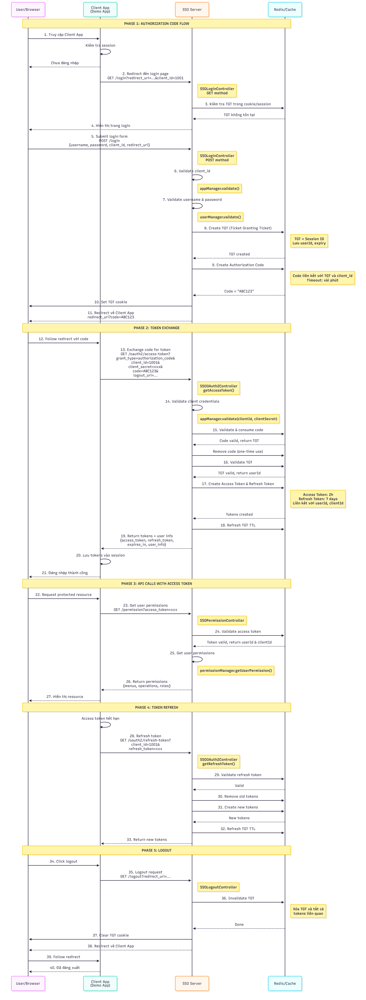
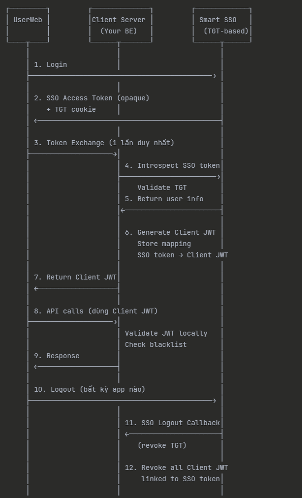
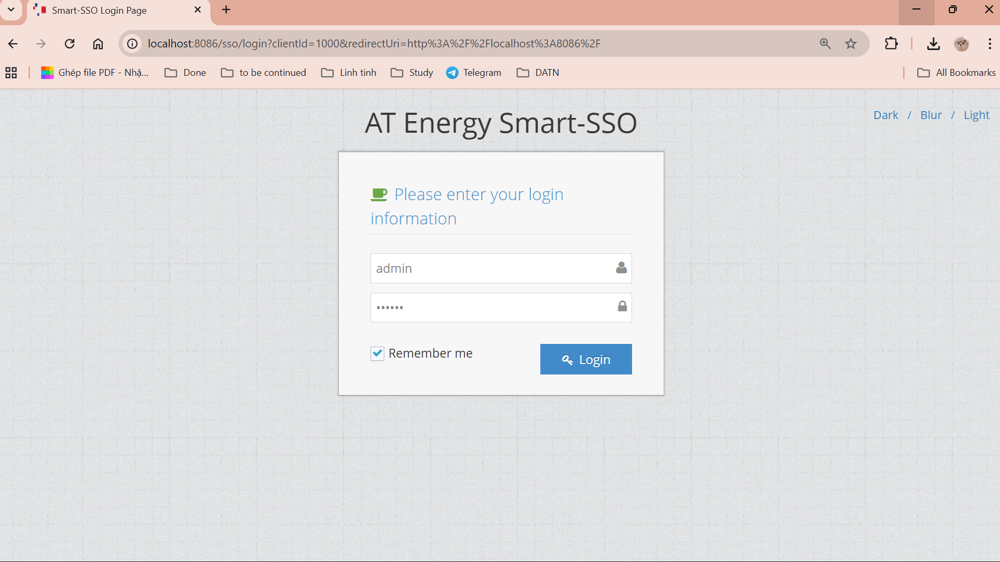
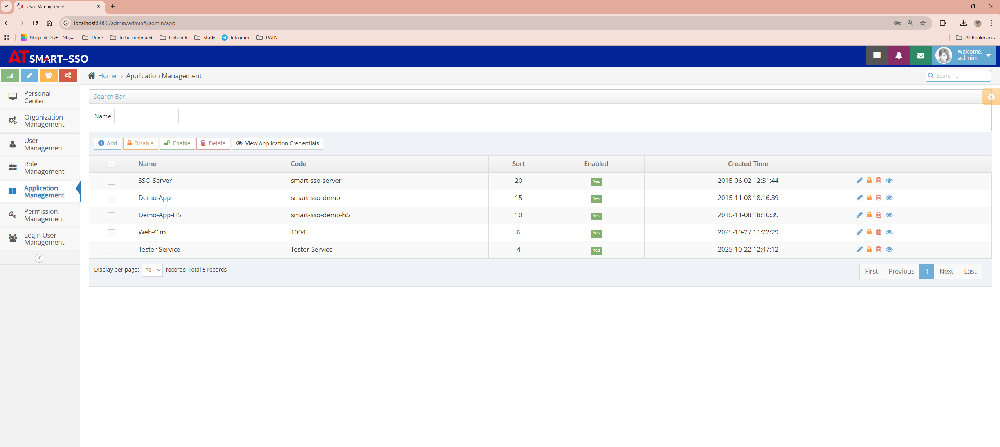
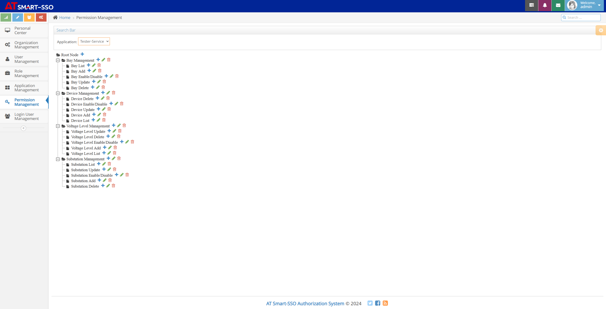
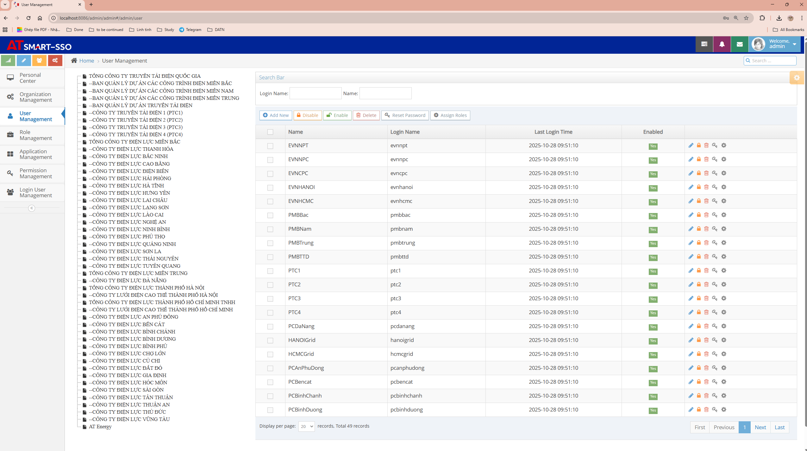
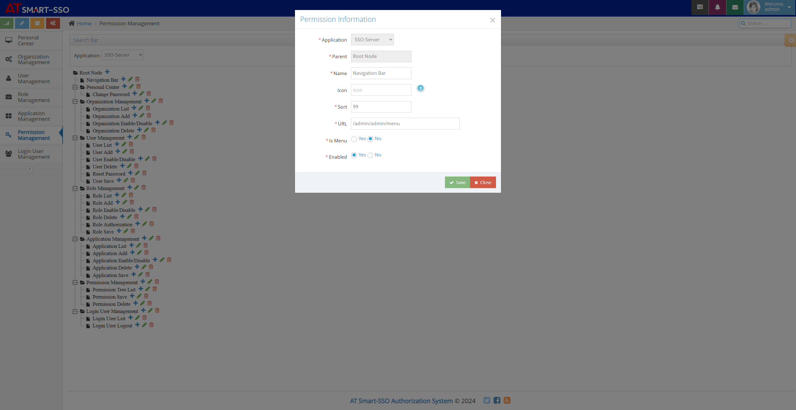

# Smart-SSO
## Overview
Smart-SSO leverages the popular SpringBoot technology, based on OAuth2 authentication combined with RBAC permission design, to create a lightweight and highly available single sign-on authentication and authorization center.

## Features

1. **Lightweight:** Minimalist implementation based on SpringBoot and OAuth2 authorization code flow;

2. **Single Sign-Out:** When client applications obtain tokens, they implicitly pass their logout addresses to the server. When logging out from any client application, the server remotely notifies all client applications to invalidate local tokens, completing single sign-out;

3. **Auto-Renewal:** Uses OAuth2's accessToken strategy. When expired, the client backend automatically calls the refreshToken refresh interface and updates the server credential validity period, completing automatic expiration renewal;

4. **Force Logout:** Administrators can actively terminate specified user sessions. The server immediately revokes the user's login credentials and notifies all associated clients through callback mechanisms to clear local sessions, implementing forced logout functionality;

5. **Cross-Domain Support:** Server and clients can complete cross-domain single sign-on and logout mechanisms under different domain names;

6. **Front-End/Back-End Separation:** Users can easily implement single sign-on features in front-end/back-end separated architectures (cookie-free mode);

7. **Button-Level Permissions:** The server categorizes permissions into menus and buttons, implementing button-level permission control through request URI and method matching;

8. **Distributed Deployment:** Both server and clients support multi-instance deployment scenarios based on Redis-shared tokens;

## Documentation
- [Smart-SSO Single Sign-On (1): Introduction](https://blog.csdn.net/a466350665/article/details/54140411)
- [Smart-SSO Single Sign-On (2): Quick Start](https://blog.csdn.net/a466350665/article/details/79628553)
- [Smart-SSO Single Sign-On (3): Integration Guide](https://blog.csdn.net/a466350665/article/details/139736085)
- [Smart-SSO Single Sign-On (4): Front-End/Back-End Separation](https://blog.csdn.net/a466350665/article/details/109742638)
- [Smart-SSO Single Sign-On (5): Distributed Deployment](https://blog.csdn.net/a466350665/article/details/109388429)

## Code Repository
**Github:** https://github.com/huynx27012003/smart-sso.git  
**Fork from:** https://github.com/a466350665/smart-sso

## Branch Information
- master branch: Based on SpringBoot 3.x + JDK 17
- 1.7 branch: Based on SpringBoot 2.x + JDK 8

## Project Structure

```lua
smart-sso
├── smart-sso-demo -- Client application example
├── smart-sso-demo-h5 -- Front-end/back-end separated client example
├── smart-sso-server -- Single sign-on permission management server
├── smart-sso-starter -- Dependency assembly module
│   ├── smart-sso-starter-base -- Common base constants, utilities, credential cleanup mechanism
│   ├── smart-sso-starter-client -- Client dependency package, client token lifecycle management
│   ├── smart-sso-starter-client-redis -- Client dependency assembly, Redis support for distributed deployment
│   ├── smart-sso-starter-server -- Server dependency package, server credential lifecycle management
│   ├── smart-sso-starter-server-redis -- Server dependency assembly, Redis support for distributed deployment
├── web-cim -- Smart SSO integrated application
│   ├── webcimfe -- Frontend application (Vue.js)
│   ├── webcimbe -- Backend REST API (Spring Boot)
```

## Technology Stack

| Technology                   | Version    | Description             |
| ---------------------- | ------- | ---------------- |
| spring-boot             | 3.3.4   | Container + MVC framework     |
| spring-boot-starter-data-redis    | 3.3.4   | Token management for distributed scenarios  |
| spring-boot-starter-freemarker | 3.3.4   | Template engine  |
| springfox-boot-starter      | 3.0.0   | Documentation     |
| mybatis-plus-spring-boot3-starter           | 3.5.7   | ORM framework  |
| postgresql    | 42.7.2   | Database driver  |
| httpclient    | 4.5.14   | Authorization code authentication, client-server communication  |

## Why Choose OAuth2?

Comparison of common SSO authentication methods:

| Feature               | Traditional Token       | JWT                | OAuth2             |
|------------------|-----------------|--------------------|--------------------|
| Single Sign-On         | Supported            | Supported               | Supported               |
| Single Sign-Out         | Supported            | Difficult to implement               | Supported               |
| Force Logout         | Supported            | Difficult to implement               | Supported               |
| Auto-Renewal         | Difficult to implement           | Supported                |Supported|
| Performance             | Average               | High            | Good      |
| Security           | Average              | Good          | High        |
| Complexity           | Average               | High          | High          |

**Explanation:**   
For traditional Token methods, the mechanism is relatively simple. Typically, the server generates a random string as a token, which is then passed between client and server for user authentication. However, this approach has significant drawbacks. Due to the lack of expiration and refresh mechanisms, auto-renewal functionality is difficult to implement, and requests from clients to servers require frequent token validation calls. Nevertheless, for small projects, especially scenarios where performance or security requirements are not particularly high, this method may be sufficient.

JWT, due to its stateless nature, only requires the server to store keys without storing token information, reducing server storage pressure. However, in SSO scenarios, implementing single sign-out and force logout functionality presents certain difficulties. These features often require backend token storage combined with logout remote notifications or shared storage, which conflicts with JWT's philosophy. For projects with extremely high security requirements, these features are indispensable.

OAuth2 is often used for third-party application authorization login and is perfectly suited for SSO scenarios, though implementation difficulty is relatively high. It naturally provides token expiration and refresh mechanisms, enabling token renewal, whereas JWT requires improvement to a dual-token approach. Each application that needs to access the OAuth2 authentication authorization center must be registered on its server and issued key information (ClientId, ClientSecret). Only then can tokens be obtained according to the process. This enables dual verification of both user identity (authorization code acquisition stage) and client application identity (accessToken acquisition stage). For authentication authorization systems, the primary task after successful login is to obtain the logged-in user's permission information in the current application. Therefore, the server must issue tokens for each client application separately for users, rather than granting access to all application resources managed by the authentication authorization center with a token obtained from a single client application, which aligns with OAuth2's original intent.

**Conclusion:**   
Smart-SSO has chosen to build on OAuth2. To address its shortcomings, some features have been carefully upgraded. For example, the client backend caches tokens, allowing user requests carrying tokens to be validated locally in the client application, greatly reducing interaction between client applications and the server. The renewal mechanism has also been improved. When the client's local token expires, the client backend initiates a refreshToken request to the server, regenerates the token and writes it back to the frontend, while extending the server credential validity period, thus implementing automatic expiration renewal functionality.

## Single Sign-On and Sign-Out Flow

## Token Exchange Flow with SSO Binding

## Demo Screenshots
### Single Sign-On Login Page


### Server Management Pages







